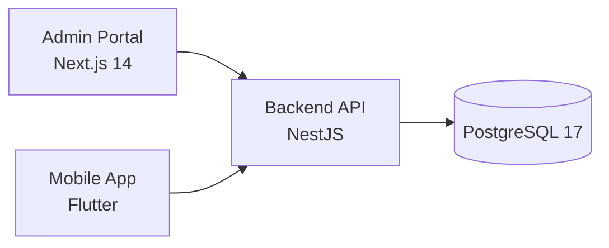

# 🧘 Wellness Package Management System (WPMS)


A **full-stack wellness package management system** built for the Fullstack Developer Assessment. This project demonstrates clean architecture, modular code organization, and cross-platform integration.

---

## 🏗 Architecture & Design Decisions

### 1. High-Level Architecture



### 2. Core Decisions

- **Unified Domain Logic**: The backend uses separate controllers for Admin and Mobile personas but shares the same underlying Service Layer to ensure data consistency.
- **Strict Validation**: Zod is used across the Backend (via `nestjs-zod`) and Frontend to ensure a robust, single-point-of-failure for data validation.
- **Platform-Ready Mobile Service**: The Flutter `ApiService` is built to be environment-aware, automatically switching between `localhost` and emulator-specific (`10.0.2.2`) addresses.
- **Global Error Handling**: A centralized NestJS exception filter maps all internal errors to specific, frontend-friendly REST responses.

---

## 📂 Project Structure

```text
wpms/
├── backend/           # NestJS REST API (Modular Architecture)
├── admin-portal/      # Next.js Dashboard (Zustand + shadcn/ui)
├── mobile_app/        # Flutter Client (Platform-aware API Service)
└── docker-compose.yml # Full-stack orchestration
```

---

## 🚀 Quick Start (Docker)

Start the entire ecosystem (DB, API, and Admin Portal) with a single command:

```bash
docker compose up -d --build
```

| Service | URL |
| :--- | :--- |
| **Backend API** | [http://localhost:3000](http://localhost:3000) |
| **Swagger UI** | [http://localhost:3000/api](http://localhost:3000/api) |
| **Admin Portal** | [http://localhost:3001](http://localhost:3001) |

---

## 📝 API Design Highlights

- **RESTful standard**: Clean HTTP path and verb usage.
- **Dto Pattern**: Every request payload is validated against a strictly typed Zod schema.
- **Separation of Concerns**: UI Controllers are light; all business logic resides in Services.

---

## 👨‍💻 Author

**Tristiyadi** - Fullstack Developer Assessment Submission
